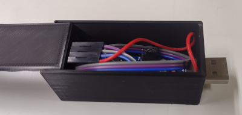
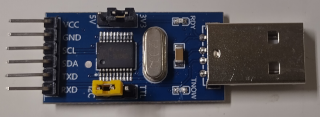
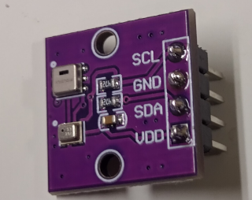
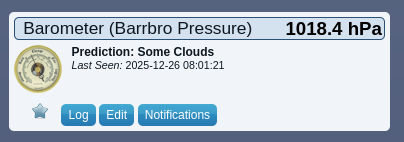
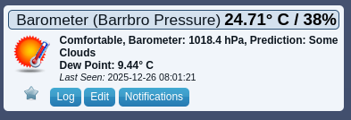
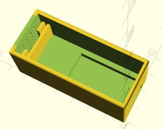

## Barrbro - An USB barometer for Domoticz/HomeAssistant

  

This repo contains source code and instructions for how to get a barometer
attached to an USB port running, and providing measurements to Domoticz/HomeAssistant
via MQTT. It does not need to be attached to the computer running Domoticz/HomeAssistant.
Currently HomeAssistant integration is untested, but it looks like Domoticz and HomeAssistant
uses the same MQTT mechanism for sensors.

### Hardware requirements
  * A computer running Linux with a free USB port. (I use Debian)
  * A CH341 USB dongle with I2C pins exposed at 3.3V level.

  

  * An AHT20+BMP280 module. The AHT20 isn't really need, if you get a module without it, you'll need to do some changes in the script.

  

  * Cables in between :-)

### Initial hardware testing

Just plug in the CHI341 dongle and run `lsusb` and it shall include a line looking like this: (Bus and Device might be different)
```
Bus 001 Device 007: ID 1a86:5512 QinHeng Electronics CH341 in EPP/MEM/I2C mode, EPP/I2C adapter
```


### Software installation

Sadly the required Linux kernel driver isn't included in 6.12 which Debian 13 runs, so you
have to compile it yourself.

```
sudo apt install linux-headers-$(uname -r) git build-essential

git clone https://github.com/frank-zago/ch341-i2c-spi-gpio.git
cd ch341-i2c-spi-gpio
make
sudo make install
cd ..
git clone https://github.com/gmelchett/barrbro.git
sudo cp barrbro/i2c-ch341.conf /etc/modprobe.d/
sudo depmod -a
```

Reboot, or manually load the modules:

```
sudo modprobe i2c-dev
sudo modprobe ch341-core
sudo modprobe i2c-ch341
```

**NOTICE** Every time you get a new kernel, you have to rebuild and reinstall the ch341 module (`make && sudo make install`)

Wire up your BMP280 module with the CH341 module, and plug in the USB port.

### Testing the hardware
```
sudo apt install i2c-tools
sudo i2cdetect -l
```
It shall include:
```
i2c-7   i2c             CH341 I2C USB bus 001 device 015        I2C adapter
```
To see if the sensors are to be found, run with `7` replaced with what matches your bus above
```
sudo i2detect 7

WARNING! This program can confuse your I2C bus, cause data loss and worse!
I will probe file /dev/i2c-7.
I will probe address range 0x08-0x77.
Continue? [Y/n]
     0  1  2  3  4  5  6  7  8  9  a  b  c  d  e  f
00:                         -- -- -- -- -- -- -- --
10: -- -- -- -- -- -- -- -- -- -- -- -- -- -- -- --
20: -- -- -- -- -- -- -- -- -- -- -- -- -- -- -- --
30: -- -- -- -- -- -- -- -- 38 -- -- -- -- -- -- --
40: -- -- -- -- -- -- -- -- -- -- -- -- -- -- -- --
50: -- -- -- -- -- -- -- -- -- -- -- -- -- -- -- --
60: -- -- -- -- -- -- -- -- -- -- -- -- -- -- -- --
70: -- -- -- -- -- -- -- 77
```

Here shows that two devices are detected on i2c bus 7, the BMP280 and the AHT20 sensors.

### Reading from the sensors

Install required python packages and test
```
sudo apt install python3-smbus2 python3-paho-mqtt
./barrbro.py --test
```
The `barrbro.py` script will do some basic sanity checks before proceeding, and unless you
are already a member of the `i2c` group, you will need to become that.
The output from `./barrbro.py --test` looks like this:

```
AHT20:
  Temperature: 24.42 °C
  Humidity:    39.09 %RH
BMP280:
  Temperature: 24.46 °C
  Pressure:    1018.38 hPa
```
(Dry and warm on top of my little server :-)

### Binding everything together

To publish measurements, where `192.168.11.115` shall be replaced with the IP address of where you MQTT server is running.
```
./barrbro.py --broker-ip=192.168.11.115
```
If there is no output, the script thinks everything works nicely. In Domoticz two new sensors will show up:

Under *Weather*:



Under *Temperature*:



### Periodically update measurements

Use cron for periodically update measurments:
```
crontab -e
```
Then add a line like this, with the full path to `barrobro.py` and with your MQTT ip:
```
*/5     *       *       *       * PATH/barrbro/barrbro.py --broker-ip 192.168.11.115
```
Will do measurements each fifth minute.

### 3D printed case



Nothing that is really needed, but looks nice.

### Software quality

It is mostly vibe coded, looking quite good. LLM isn't any good at openscad, so I did the
case. The code is a mess, so don't look at it ;-)

### License
MIT for the Python script, CC‑0 (Public Domain Dedication) for everything else.
